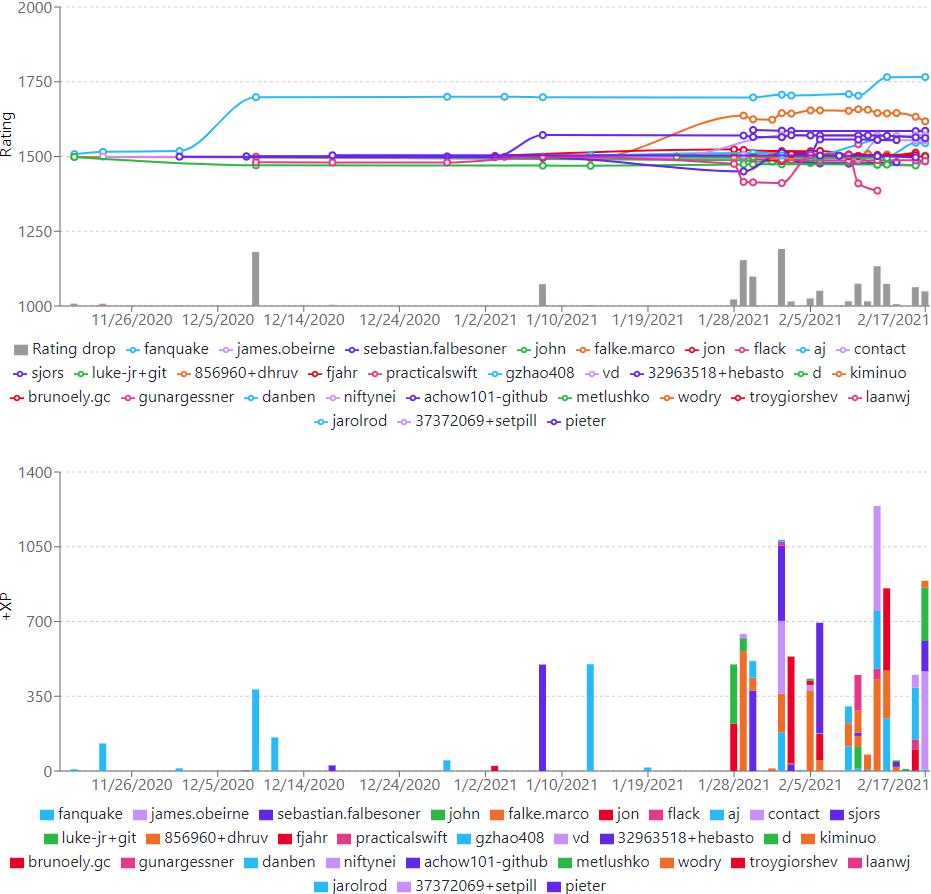

# Bitbucket Pipelines Pipe:  devrating-bb-pipe

Builds a rating of contributors by the stability of code. 
You can compete with each other and earn XP for pull requests.

## Demo

[](https://devrating.net/#/repositories/sgUj3bYc7wXTAXjF5DN0ON7lTTT2/Ryujinx%2FRyujinx)

## YAML Definition

Add the following snippet to the script section of your `bitbucket-pipelines.yml` file:

```yaml
script:
  - pipe: docker://victorx64/devrating-bb-pipe:3.2.0
    variables:
      DEVRATING_ORGANIZATION: "<string>"
      DEVRATING_KEY: "<string>"
      BITBUCKET_APP_PASSWORD: "<string>" # username:password
      BASE_BRANCH: "<string>"
      DEVRATING_REPOSITORY: "<string>" # Optional
      MAX_ADDITIONS: "<number>" # Optional
```

## Variables

| Variable                   | Usage                                                                                                                                             |
| -------------------------- | ------------------------------------------------------------------------------------------------------------------------------------------------- |
| DEVRATING_ORGANIZATION (*) | Your Organization_ID. Visit https://devrating.net/#/keys to obtain                                                                                |
| DEVRATING_KEY (*)          | Your API_Key. Visit https://devrating.net/#/keys to create new                                                                                    |
| BITBUCKET_APP_PASSWORD (*) | Your username and BitBucket App Password. Visit https://bitbucket.org/account/settings/app-passwords/ to create new. Permit Pull requests reading |
| BASE_BRANCH (*)            | Your main development branch (usually 'master' or 'main')                                                                                         |
| DEVRATING_REPOSITORY       | The repository name to be shown on devrating.net                                                                                                  |
| MAX_ADDITIONS              | Skips PRs with more added lines of code. 4000 by default. "0" — no limits                                                                         |

_(*) = required variable._

## Prerequisites

Sign in to https://devrating.net to grab the keys.

## Examples

Basic example:

```yaml
script:
  - pipe: docker://victorx64/devrating-bb-pipe:3.2.0
    variables:
      DEVRATING_ORGANIZATION: $DEVRATING_ORGANIZATION
      DEVRATING_KEY: $DEVRATING_KEY
      BITBUCKET_APP_PASSWORD: username:$BITBUCKET_APP_PASSWORD
      BASE_BRANCH: "master"
```

Advanced example:

```yaml
script:
  - pipe: docker://victorx64/devrating-bb-pipe:3.2.0
    variables:
      DEVRATING_ORGANIZATION: $DEVRATING_ORGANIZATION
      DEVRATING_KEY: $DEVRATING_KEY
      BITBUCKET_APP_PASSWORD: username:$BITBUCKET_APP_PASSWORD
      BASE_BRANCH: "master"
      DEVRATING_REPOSITORY: "foo/bar" # Optional
      MAX_ADDITIONS: "4000" # Optional
```

## Support

It should be clear how to use. If not, ask us in
our [Telegram chat](https://t.me/devratingchat).